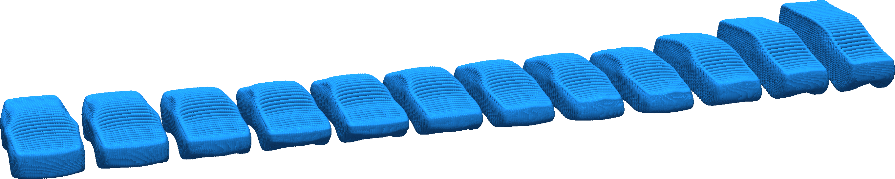

# Geometric Deep Learning for Design Applications (GDL4DesignApps)

<!-- <p align="center">
  
</p> -->
<!--  -->


GDL4DesignApps is a software repository for training and applying geometric
 deep learning models in engineering design and optimization tasks. The 
 software is an outcome of the research performed in the framework of the 
 project _Experience-based Computation: Learning to Optimise_ (ECOLE). 
 ECOLE is an Innovative Training Network that is part of the Marie 
 Skłodowska-Curie Actions (ITN-MSCA, Grant number 766186) and funded by 
 the Horizon2020 program.

---
## Software Pre-requisites
We developed our software in a machine with Ubuntu 18.04 utilizing Python 
3.6.13 in an Anaconda environment with the following libraries installed:

| Library       | Version       | Library       | Version       |
| ------------- |:-------------:| ------------- |:-------------:|
| Numpy         | 1.19.1        | tensorflow-gpu| 1.14.0        |
| scikit-learn  | 0.23.2        | TFLearn       | 0.3.2         |
| pandas        | 1.1.0         | cudatoolkit   | 10.1.168      |
| matplotlib    | 1.19.1        | cudnn         | 7.6.5         |
| pyvista       | 0.31.3        | Platypus      | 1.0.4         |
| seaborn       | 0.11.2        | pycma         | 3.1.0         |

We tested our scripts on a machine with two CPUs Intel(R) Xeon(R) Silver, clocked at 2.10
GHz, and four GPUs NVidia(R) GeForce(R) RTX 2080 Ti with 12 GB each.

**Warning**: It is possible to utilize the software exclusively with CPU and Microsoft(R) Windows(R) as operational system. However, the performance of the software might be restricted.

---
## Licensing
The software in this repository is licensed under the GPL-3.0. For more details on the license, please check [the license file.](LICENSE)

---
## Software Modules

### Methods

The core methods of our software are implemented in the [`preprocess_methods.py`](include/preprocess_methods.py). The methods are divided in five classes:

+ [CAE2PC](include/preprocess_methods.py#L98): This class contains the methods for sampling 3D point clouds from computer aided design/engineering (CAD/E) models, _e.g._ STL meshes.

+ [PC_AE](include/preprocess_methods.py#L583): This class contains the functions to generate the parameters and corresponding Tensorflow graph for training the 3D point cloud autoencoder utilized in our research.

+ [PC_VAE](include/preprocess_methods.py#L850): This class contains the functions to generate the parameters and corresponding Tensorflow graph for training the 3D point cloud variational autoencoder utilized in our research.

+ [losses](include/preprocess_methods.py#L1201): Class that comprises the functions to calculate the mean-squared distance (MSD) and Kullback-Leibler divergence (KLD) on GPU for training the architectures. The Chamfer Distance (CD) is also available, however only for computation on CPU.

+ [arch_training](include/preprocess_methods.py#L1261): Class with the functions to train the deep-generative models. Examples of applications are available [here](examples).

### Applications

The applications of the architectures include compression of 3D point cloud data into latent representations, shape generation from latent space samples, and feature visualization. We scripted the functions for these applications in the file [`designapps.py`](gdl4designapps/designapps.py) in the class [DesignApps](gdl4designapps/designapps.py#L82). We also implemented tools for visualizing the geometric data, _e.g._, 3D point clouds and meshes, in the class [Vis3D](gdl4designapps/designapps.py#L208).

---
## Cloning and Installation

To clone the repository through the terminal (either in Linux or GitBash), run the following command:

```
git clone https://github.com/HRI-EU/GDL4DesignApps.git
```

Otherwise, download the compressed scripts as a ZIP file from the web interface and extract the software to your directory of preference. 

We recommend to install our library in a dedicated _conda_ environment. To create and activate the environment using anaconda, utilize the following commands in a terminal window:

```
conda create -n designenv python=3.6 tensorflow-gpu cudatoolkit=10.1.168 matplotlib libtiff libgcc libgcc-ng cudnn cupti

conda activate designenv
```

After activating the environment, install the libraries that are [pre-requisite for our software](). To install our library (in editable mode) with `pip`, go to the directory where the repository was locally stored through the terminal and run the following command

```
pip install -e .
```

To test if the software was correctly installed, run the `unittest.sh`. The script tests if the library and modules can be imported to a Python script and tests the functionality of the main functions. If no unexpected error are reported in the terminal screen or in the file `log_utest.dat`, then the library was successfully installed and the functions are available for use.

---
## How to Cite
If you think our work is interesting and utilize in your research/application, please consider citing the papers that led to the development of this library.

**3D Point Cloud Autoencoder**

Read our paper [here](https://ieeexplore.ieee.org/document/9446541).
```
@ARTICLE{Rios2021a,
  author={Rios, Thiago and van Stein, Bas and Bäck, Thomas and Sendhoff, Bernhard and Menzel, Stefan},
  journal={IEEE Transactions on Evolutionary Computation}, 
  title={{Multi-Task Shape Optimization Using a 3D Point Cloud Autoencoder as Unified Representation}}, 
  year={2021},
  volume={},
  number={},
  pages={1-1},
  doi={10.1109/TEVC.2021.3086308}}
```

**3D Point Cloud Variational Autoencoder**

Read our paper [here](https://www.honda-ri.de/publications/publications/?pubid=4510).
```
@INPROCEEDINGS{Saha2020,
  author    = {Saha, Sneha and Menzel, Stefan and Minku, Leandro L. and Yao, Xin and Sendhoff, Bernhard and Wollstadt, Patricia},
  booktitle = {2020 IEEE Symposium Series on Computational Intelligence (SSCI)}, 
  title     = {{Quantifying The Generative Capabilities Of Variational Autoencoders For 3D Car Point Clouds}}, 
  year      = {2020},
  pages     = {1469-1477},
  doi       = {10.1109/SSCI47803.2020.9308513}
}
```

**Feature Visualization for 3D Point Cloud Autoencoders**

Read our paper [here](https://www.honda-ri.de/publications/publications/?pubid=4354).
```
@INPROCEEDINGS{Rios2020a,
  author      = {Rios, Thiago and van Stein, Bas and Menzel, Stefan and Back, Thomas and Sendhoff, Bernhard and Wollstadt, Patricia},
  booktitle   = {2020 International Joint Conference on Neural Networks (IJCNN)}, 
  title       = {{Feature Visualization for 3D Point Cloud Autoencoders}}, 
  year        = {2020},
  pages       = {1-9},
  doi         = {10.1109/IJCNN48605.2020.9207326}
  }
```

<!-- <p align="center">
  
</p> -->
